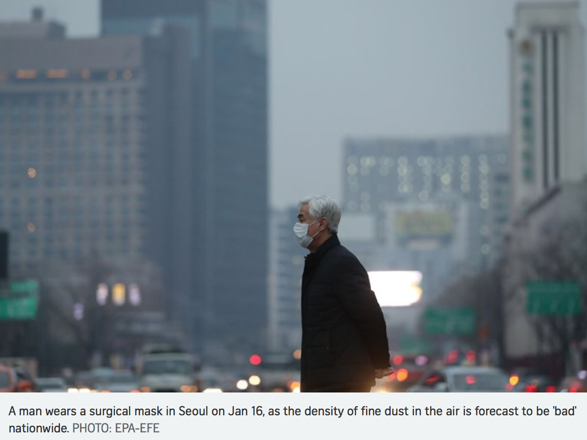
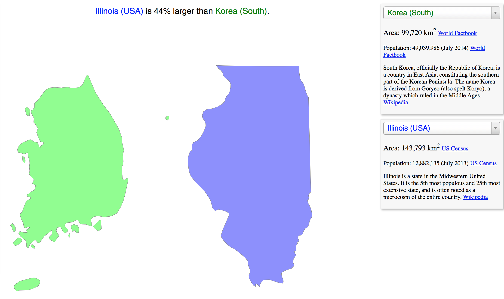
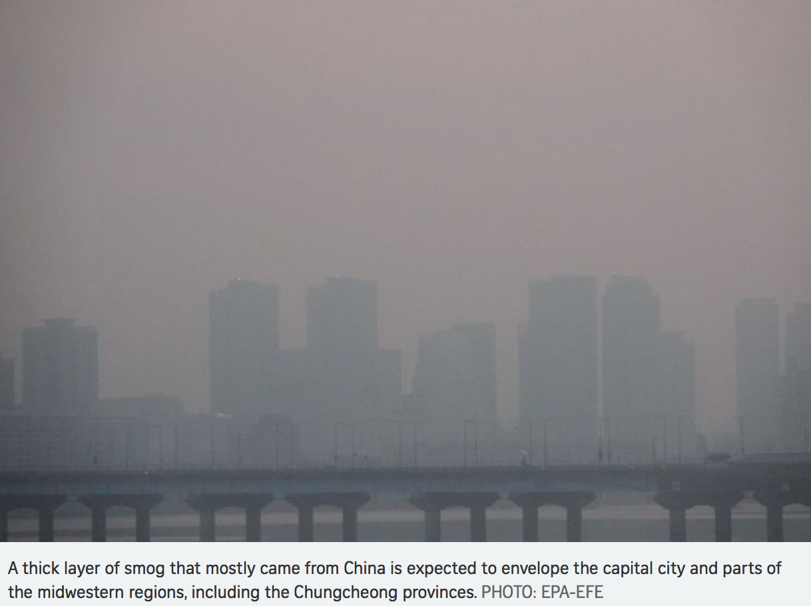
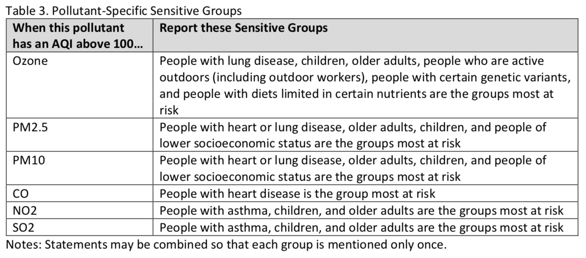
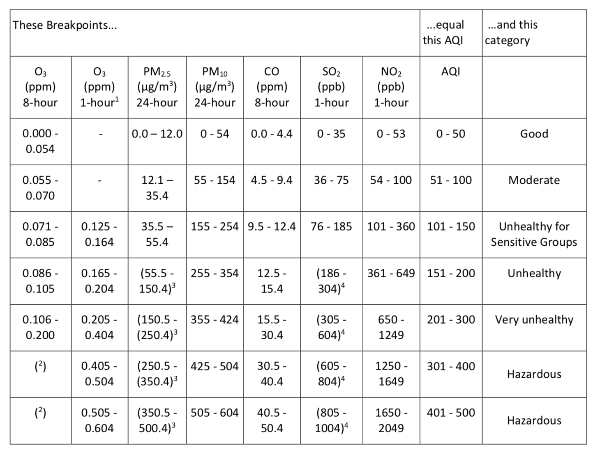
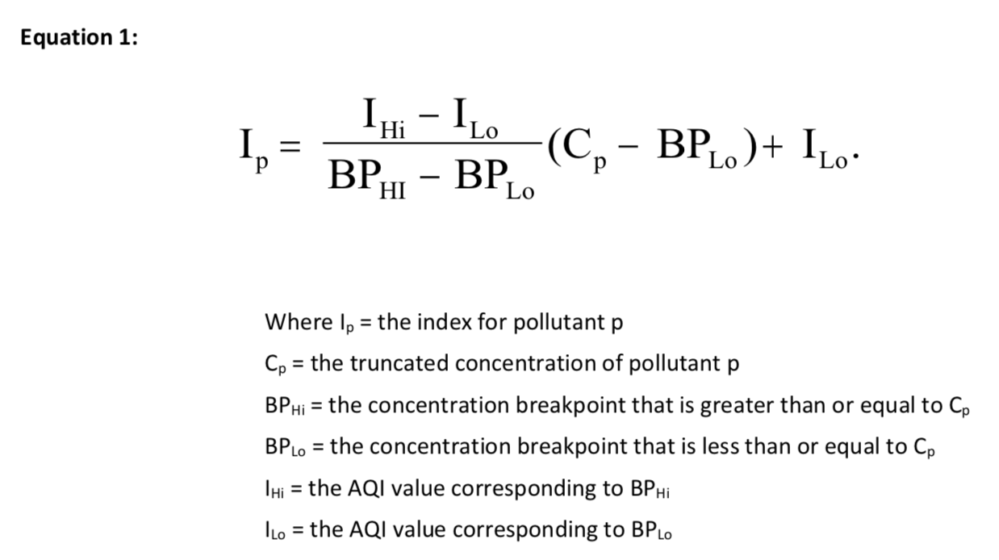
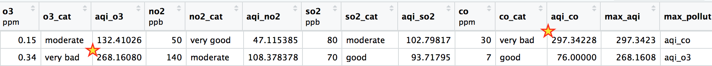

### Load EDA.R 
```{r, message=FALSE, warning=FALSE, results=FALSE}
source("EDA.R")

aqi_test <- aqi_test %>% 
  mutate(final_cat = factor(final_cat, levels = levels(aqi_train$final_cat)),
         pm10_cat = factor(pm10_cat, levels = levels(aqi_train$pm10_cat)),
         pm25_cat = factor(pm25_cat, levels = levels(aqi_train$pm25_cat)),
         no2_cat = factor(no2_cat, levels = levels(aqi_train$no2_cat)),
         so2_cat = factor(so2_cat, levels = levels(aqi_train$so2_cat)),
         o3_cat = factor(o3_cat, levels = levels(aqi_train$o3_cat)),
         co_cat = factor(co_cat, levels = levels(aqi_train$co_cat)))
```
All the EDA work is loaded.

### Libraries
```{r, message=FALSE}
library(tidyverse)
library(leaps)
library(tree)
library(knitr)
library(kableExtra)
library(ggdendro)
library(clustMixType)
library(randomForest)
library(keras)
library(ggmap)
library(maps)
library(e1071)
library(kernlab)  
library(onehot)
```
All the necessary packages have been loaded.

### Background Information
**Citation:** <br>
Moch, J. (n.d.). Air Quality Index Archive based on ground monitors in China. Retrieved April 13, 2018, from http://aqi.cga.harvard.edu/china/about/
conducted by Harvard John A. Paulson School of Engineering and Applied Sciences

Direct link to the datasets: http://aqi.cga.harvard.edu/china/  <- then click on aqi.csv


**From my DataMemo:** 
In general, air quality is influenced by various factors such as weather, and weather forecast (prediction) is done using a lot of quantitative data of the current state. Therefore, my project is not about making predictions, but more about making **inferences** and learning how air quality is determined using the dataset I have. Also, I am planning to use the average "Air Quality Category", described in EDA, as my respondent variable. So my project will be a **classification** type. Classification and Regression Tree (CART) will (most likely) be used extensively for this project.


```{r, echo=FALSE}
#Table formatting function
table_nice <- function(x){
  kable(x, "html") %>%
    kable_styling(full_width = FALSE, position = "left")
}
```

### Motivation



Air pollution has started to become much more serious environmental problem in South Korea lately. One major cause of air pollution is the high population density of Korea. South Korea is 0.7 times as big as Illinois, and yet the population of Korea is more than 4 times greater than the population of Illinois. In fact the population of capital city Seoul is around 10.3 million; Seoul's population density is almost twice that of New York City, four times higher than Los Angeles.



Also, due to natural environmental forces such as wind that blows from China, another country that also suffers a lot from air pollution, the air quality in the Korean peninsula becomes ineffably worse. Therefore, South Korean government is working hard to improve air quality; for example one strategy was to offer **free public transportation** to limit car use: https://www.straitstimes.com/asia/east-asia/free-public-transport-in-seoul-amid-thick-smog. However, none of the strategies has proven to be very effective. 

Below is a picture showing the obnoxious air quality of Korea when especially large amount of thick smog and pollutants have flown to the Korean peninsula from China by wind.



### Pollutants
The United States Environmental Protection Agency (EPA) keeps track of 6 major air pollutants: 

* Ozone 
* PM2.5 
* PM10 
* CO
* $NO_2$
* $SO_2$

PM2.5 stands for particulate matter 2.5 micrometers or less in diameter. Particulate Matters are the sum of all solid and liquid particles suspended in air many of which are hazardous. This complex mixture includes both organic and inorganic particles, such as dust, pollen, soot, smoke, and liquid droplets.

The following table summarizes the detrimental health effects that each pollutants can cause on different groups of people. 



### About our training set  - withOUT AQI score, ie, raw concentration
I will perform the same initial exploration of my training set that I performed in my EDA. In my EDA, I performed the following analysis using the **entire set**. Here, I am using the training set, which is 85% of the entire data set. When AQI score is **not** computed (and simply raw concentrations are used), we see that PM2.5 seems to be the most problematic pollutant; it seems to have the highest scaled concentration.
```{r, warning = FALSE}
#training set; pollutants by hour
aqi_train %>% 
  mutate(
    sc_pm25 = pm25 / sd(pm25, na.rm = T),
    sc_pm10 = pm10 / sd(pm10, na.rm = T),
    sc_o3   = o3   / sd(o3,   na.rm = T),
    sc_no2  = no2  / sd(no2,  na.rm = T),
    sc_so2  = so2  / sd(so2,  na.rm = T),
    sc_co   = co   / sd(co,   na.rm = T)
  ) %>% 
  group_by(hour) %>% 
  summarise( pm25    = mean(sc_pm25, na.rm = TRUE), 
             pm10    = mean(sc_pm10, na.rm = TRUE),
             o3      = mean(sc_o3,   na.rm = TRUE),
             no2     = mean(sc_no2,  na.rm = TRUE),
             so2     = mean(sc_so2,  na.rm = TRUE),
             co      = mean(sc_co,   na.rm = TRUE)
             )%>%
  gather(pm25, pm10, o3, no2, so2, co, key = pollutants, value = scaled_mean) %>%
  ggplot( aes( x = hour ))+
  geom_bar( aes(y = scaled_mean, fill = pollutants), stat = "identity", position = "dodge")


#By pollutants
# grouping by pollutants
poll_stat <- aqi_train %>% 
  select(pm25, pm10, o3, no2, so2, co) %>% 
  gather() %>% 
  group_by(key) %>% 
  summarise(min   = min(value, na.rm = TRUE),
            max   = max(value, na.rm = TRUE),
            rng   = max - min,
            mean  = mean(value, na.rm = TRUE),    #center
            median = median(value, na.rm = TRUE),
            sd    = sd(value, na.rm = TRUE),      #spread
            iqr   = IQR(value, na.rm = TRUE)) 
poll_stat %>% 
  mutate(scaled = mean / sd,
         sdup = scaled + 1.96,     #95% CI
         sddw = scaled - 1.96) %>% 
  ggplot(aes(key)) +
  geom_point(aes(y = scaled, color = key)) +
  geom_point(aes(y = sdup), pch = 2) +    # upper bound for 95% CI
  geom_point(aes(y = sddw), pch = 6) +    # lower bound for 95% CI
  labs(title = "Scaled Average Concentrations",
       x = "Key Pollutants",
       y = "Scaled Concentration",
       caption = paste("since this shows *scaled* concentration, each 
                       pollutant's concentration can be compared to one another")) +
  geom_label_repel(aes(label = key, y = scaled, color = key), 
                   data = poll_stat_helper,
                   segment.color = NA,
                   size = 2.5) +
  theme_bw() +
  theme(legend.position = "none") 
```


### About our training set - WITH AQI score
The AQI score conversion from raw concentration is simple. First of all, we need to know in which air-quality-category the raw concentrations fall into. The table below uses 6 air quality categories: 

* Good, Moderate, Unhealthy for Sensitive Groups, Unhealthy, Very Unhealty, Harzardous, Harzardous

I used similar shorter-name (to write shorter code) categories:

* "very good", "good", "moderate", "bad", "very bad", "dangerous", "toxic"

For each pollutant's concentration, find the box that the concentration falls in and then move across to the right to see approximately what the corresponding **AQI score** would be and which **category** the concentration falls into.



The actual AQI score conversion is all about finding the concentration breakpoints of each raw concentration and then using the formula below. Long functions were written in EDA to convert every raw concentration into AQI scores. You can find out exact details of AQI conversion formula by clicking on the link below the following forumla (on page 11). Functions that performs AQI score conversions were written and used in EDA.



The **final AQI score** is the highest AQI score value calculated for each pollutant. For example, in the figure below, I put stars next to the AQI scores that are used as the final AQI scores. The final AQI score is the score under the "max_aqi" column in the figure below.




After the raw concentrations have been **converted** to the AQI score, we see that the most problematic pollutant seems like $O_3$, and **not** PM2.5.

```{r, warning = FALSE}
aqi_train %>% 
  ggplot(aes(reorder(max_pollut, max_aqi, median), max_aqi)) +
  geom_point(aes(col = final_cat)) + 
  geom_boxplot(size = 0.05, alpha = 0.3)+
  theme_bw()+
  theme(legend.position = "none") 

aqi_train %>% 
  ggplot(aes(final_cat))+
  geom_bar(aes(fill = max_pollut), , position = "dodge")+
  ylim(c(0, 600)) +
  coord_flip() +
  theme_bw()
```

**So why does $O_3$, when converted to AQI scores, turn out to be such a problematic pollutant?** According to  **Table 3** under the section **Pollutants**  that describes which specific groups of people are affected by each pollutant, we can see that $O_3$ pollutant seems to affect the largest number of different groups. I think that is the reason why ozone's concentrations end up becoming the most frequently used determinant of the final AQI score.


### Map Visualization
This is a map visualization of the entire dataset (training & validation sets). We see that most of the data is gathered from Eastern China, and also majority of the AQI scores fall into the **very bad** category. All these categories were determined by using the AQI scores.
```{r, warning=FALSE, message=FALSE}
# --------getting the map
china <- get_map("china", maptype = "roadmap", zoom = 4) %>% 
  ggmap()
# china
# 
# --------putting points on the map
# china + 
#   geom_point(aes(x =  117, y = 40),   #one point
#              color = "red", size = 3)
# china +
#   geom_point(aes(x = longitude, y = latitude),  #all the points
#              data = aqi_train)

china +
  geom_point(aes(x = longitude, y = latitude , col = final_cat), 
             data = na.omit(aqi)) +
  scale_color_manual(values=c("yellow", "orange", "red", "purple", "black", "black")) +
  theme(legend.position = "top")
```


### Best Subset / Forward & Backward
Because the final AQI is determined by the maximum AQI score (there is a **formula** to compute the final AQI score), perhaps it is not very meaningful to perform the best subset selection. However, I thought it would be nice to see if **statistical learning mechanism** also agrees with my dataset above that $O_3$ is the most frequently used pollutants for determining the final AQI score. Also, I was curious to see if any of the non-pollutant variables (especially, atmospheric variables) had any relatively strong correlation with the maximum/final AQI score.

As you can see from the result below, $O_3$ is the first pollutant to be added for **best subset** and **forward** seleciton; and it is also the last pollutant to remain in the backward selection.

Note that all six pollutants as well as all the atmospheric variables such as pressure, wind, temp, dewpoint, and humidity were included. But as you can see from the results below, the pollutants are always prioritized first; atmospheric variables are added only after ALL the pollutants' AQI scores are included. It is also interesting to see that, among the **non**-pollutant variables, **humidity** is selected first for the best subset and forward seleciton, and discarded last for the backward selection.

* Best subset selection
```{r}
regfit_full <- aqi_train %>% 
  regsubsets(max_aqi~aqi_pm10+aqi_pm25+aqi_no2+aqi_so2+aqi_o3+aqi_co+   #pollutants
               pressure+wind+hour+temp+dew+humid,                       #atm_var
             data = .,
             nvmax = 7)  #to return maximum 12 variables
reg_summary <- regfit_full %>%
  summary()

#into a nice table format
    #notice aqi_o3 is selected first
    #notice no atmospheric variables are selected before all the pollutants are selected
    #but humid is selected first among the atmospheric variables
reg_summary$outmat %>%
  data.frame() %>%
  rownames_to_column(var = "num_variables") %>%
  kable("html") %>%
  kable_styling(bootstrap_options = "striped", full_width = FALSE, font_size = 10)

```

* Forward Selection
```{r}
regfit_fwd <- aqi_train %>% 
  regsubsets(max_aqi~aqi_pm10+aqi_pm25+aqi_no2+aqi_so2+aqi_o3+aqi_co+   #pollutants
               pressure+wind+hour+temp+dew+humid,                       #atm_var
             data = .,
             nvmax = 7,
             method = "forward")    #forward selection

regfit_fwd %>%
  summary() %>%
  .$outmat %>%
  data.frame() %>%
  rownames_to_column(var = "num_variables") %>%
  kable("html") %>%
  kable_styling(bootstrap_options = "striped", full_width = FALSE, font_size = 10) #Again all the pollutants first, and then humid
```

* Backward Selection
```{r}

regfit_bwd <- aqi_train %>% 
  regsubsets(max_aqi~aqi_pm10+aqi_pm25+aqi_no2+aqi_so2+aqi_o3+aqi_co+   #pollutants
               pressure+wind+hour+temp+dew+humid,                       #atm_var
             data = .,
             nvmax = 7,
             method = "backward")    #backward selection

regfit_bwd %>%
  summary() %>%
  .$outmat %>%
  data.frame() %>%
  rownames_to_column(var = "num_variables") %>%
  kable("html") %>%
  kable_styling(bootstrap_options = "striped", full_width = FALSE, font_size = 10) #Again all the pollutants first, and then humid

```


### Single classification Tree
Our single classification tree also tells us that the AQI score of $O_3$ is the most important factor in determining the final category of the air quality because the top three internal nodes are occupied by the AQI score of $O_3$.
```{r}

tree_aqi_train <- tree(final_cat ~ aqi_pm10+aqi_pm25+aqi_no2+aqi_so2+aqi_o3+aqi_co+
                         pressure+wind+hour+temp+dew+humid,
                       data = aqi_train)
plot(tree_aqi_train)
text(tree_aqi_train, pretty = 0, cex = 0.7) #notice that the AQI score of o3 occupies the top three internal nodes
```

10-fold Cross-valiation of the single classfication tree
```{r}
set.seed(3)
cv_tree <- cv.tree(tree_aqi_train, FUN = prune.misclass)
tibble(size = cv_tree$size, k = cv_tree$k, cv_error = cv_tree$dev) %>% 
  ggplot(aes(x = size, y = cv_error)) +
  geom_point() +
  geom_line() +
  geom_vline(xintercept = cv_tree$size[cv_tree$dev == min(cv_tree$dev)],
             color = "royalblue") +   # 9 leaves
  theme_bw()
```
<br>

**Pruned Tree** <br>
A tree with 9 leaves.
```{r}
tree_pruned <- prune.misclass(tree_aqi_train, best = 9)
plot(tree_pruned) 
text(tree_pruned, pretty = 0, cex = 0.5)
```
<br>

**Confusion Table** with the pruned tree, using the validation set
```{r}
tree_pred <- predict(tree_pruned, aqi_test, type = "class")
table(tree_pred, aqi_test$final_cat) %>%
  table_nice()
```

Correct rate (from the above confusion table)
```{r}
mean(tree_pred == aqi_test$final_cat, na.rm = T) %>% kable("html") %>%
  kable_styling(full_width = FALSE, position = "left") %>%
  add_header_above(c("correct rate" = 1))  # 0.9244444
```

### Random Forest
```{r}
set.seed(3)
aqi_train_pollut <- na.omit(aqi_train) %>% 
  select(contains("aqi"), max_pollut, final_cat) %>% 
  mutate(final_cat = factor(final_cat)) #this step is necessary to make the subsequent randomForest() function to work. Otherwise there will be no data corresponding to the category "very good" and "good"; then randomForest will produce an error
aqi_rf <- randomForest(final_cat ~ aqi_pm10+aqi_pm25+aqi_no2+aqi_so2+aqi_o3+aqi_co, 
                       data = aqi_train_pollut,
                       mtry = 3,
                       importance = TRUE)
aqi_rf_pred <- predict(aqi_rf, newdata = aqi_test, type = "class")
#  mean(aqi_rf_pred != aqi_test$final_cat)  #again this is caused by the fact that not all categories are included in aqi_train_pollut, namely "very good" and "good"
```

**Variable Importance**

The left column/graph is the mean decrease of accuracy in predictions on the out of bag samples when a given variable is exluded from the model. The right is a measure of the total decrease in node impurity that results from splits over that variable, averaged over all trees. The results indicate that the AQI score of $O_3$ and then PM2.5 are by far the two most important variables.
```{r}
importance(aqi_rf) %>% as_tibble() %>% 
  mutate(pollutant = c("aqi_pm10", "aqi_pm25", "aqi_no2", "aqi_so2", "aqi_o3", "aqi_co")) %>% 
  .[,c(8,6:7)] %>% 
  arrange(desc(MeanDecreaseAccuracy)) %>% table_nice()
varImpPlot(aqi_rf)
```


### Principal Component Analysis
```{r}
atm_variables <- c("pressure", "wind", "hour", "temp", "dew", "humid")

pca <- na.omit(aqi_train) %>%   #missing values are gone
  select(contains("aqi"), - max_aqi) %>% 
  prcomp(scale = TRUE)

pca$rotation %>% 
  table_nice()
```

**Biplot**, using the first 2 principal component analysis

The first loading vector places approximately equal weight on $NO_2$, $SO_2$, PM2.5, and PM 10. The second loading vector places most of its weight on $O_3$ and also slightly weakly on CO. Once again, it is interesting to see how $O_3$ seems to **stand out** from the rest of the pollutants.
```{r, message=FALSE}
ggbiplot::ggbiplot(pca, scale = 0, alpha = 0.1)
```


**Scree Plot** <br>
Proportion of variance explained each principal components
```{r}
#variance for each component
pca_var <- pca$sdev^2
#Proportion of variance explained by each principal component
pve <- pca_var/sum(pca_var)

tibble(x = 1:6, y1 = pve, y2 = cumsum(pve)) %>%
  ggplot(aes(x)) +
  ylim(c(0,1)) +
  geom_point(aes(y = y1), size = 3) +
  geom_line( aes(y = y1) ) +
  geom_point(aes(y = y2), size = 3) +
  geom_line( aes(y = y2), color = "royalblue") +
  xlab("Principal Component") +
  ylab("Proportion of Variance Explained")
```

### Clustering
Performing 3-Means Clustering resulted in producing 3 groups with the following characteristics. Interestingly, we can see that the 3 clusters seem to be most differentiated by the AQI score of $O_3$.  
```{r, message = FALSE, results="hide"}
aqi_train_dat <- na.omit(aqi_train) %>%   #omitting all NA's
  select(stationname, contains("aqi"), final_cat, - max_aqi, longitude, latitude) %>% 
  as.data.frame()

set.seed(3)
aqi_kproto <- kproto(aqi_train_dat[,2:8], k = 3, nstart = 25)
par(mfrow=c(1,4))
clprofiles(aqi_kproto, aqi_train_dat)
```
```{r}
aqi_train_dat <- aqi_train_dat %>% 
  mutate(cluster = factor(aqi_kproto$cluster)) %>%
  as_tibble()

#Create a table showing a sample of colleges from each cluster
set.seed(3)
tibble(Cluster_1 = aqi_train_dat %>%
         filter(cluster == 1) %>%
         sample_n(15) %>%
         pull(stationname),
       Cluster_2 = aqi_train_dat %>%
         filter(cluster == 2) %>%
         sample_n(15) %>%
         pull(stationname),
       Cluster_3 = aqi_train_dat %>%
         filter(cluster == 3) %>%
         sample_n(15) %>%
         pull(stationname)) %>%
  kable("html") %>%
  kable_styling(full_width = FALSE, position = "left") %>%
  add_header_above(c("Sample of areas from each cluster" = 3))
```

**Map Visualization** by cluster (in different colors)

I was originally hoping to see **geographical separation** among the three clusters. However, as you can see from the map visualization below, they do **not** seem to be separated by location. 
```{r, warning=FALSE}
china +
  geom_jitter(aes(x = longitude, y = latitude, col = cluster), 
              data = aqi_train_dat) +
  scale_color_manual(values=c("red", "blue", "black")) +
  theme(legend.position = "top")
```

### Vector Machine
SVM are intended for the **binary classification** setting in which there are two classes. Therefore I decided simplify the 6 categories into 2 categories. The categories "very bad", "dangerous", "toxic" forms one category and the rest forms another category. However, as you can see below from the map, the majority of the points overlap one another, so I knew that support vector classifier (linear kernel) would be almost useless in this dataset. Also, the polynomial kernel proved to be not helpful and computationally too expensive (code is contained inside the rmd file; it is just **not** evaluated). Only the **radial** kernel have shown to be somewhat useful as you can see below.
```{r}
#divide into 2 groups for final_cat
  #for train
aqi_train_svm <- aqi_train %>% 
  na.omit() %>%    #NA's are omitted
  mutate(two_cat = factor( final_cat %in% c("very bad", "dangerous", "toxic")))%>% 
  select(two_cat, latitude, longitude) 
  
  #for test
aqi_test_svm <- aqi_test %>% 
  na.omit() %>%    #NA's are omitted
  mutate(two_cat = factor( final_cat %in% c("very bad", "dangerous", "toxic")))%>% 
  select(two_cat, latitude, longitude) 

china +
  geom_jitter(aes(x = longitude, y = latitude, col = two_cat), 
              data = aqi_train_svm)
```

**Support Vector Classifier**

10-fold cross validation was used for determining the optimal cost. As you can see, linear kernel is **not** helpful in retrieving any kind of useful information.
```{r}
set.seed(3)
tune_lin <- tune(svm, two_cat ~ ., 
                 data = aqi_train_svm, kernel = "linear",
                 ranges = list(cost = c(0.1, 0.5, 1, 5, 10, 50, 100)),
                 scale = TRUE)
# tune_lin %>% summary()
lin_best_mod <- tune_lin$best.model
par(mar=c(1,1,1,1))
plot(lin_best_mod, aqi_train_svm, latitude ~ longitude)
```

**Support vector Machines**

* with **radial** kernel
```{r, include=F}
# map("world", "china")
china1 <- map("world", "china")
# china1 %>% names()  #"x"     "y"     "range" "names"
# plot(y = china1$y, x=china1$x, type = "l")  #draws china
# points(y = china1$y, x=china1$x, type = "l", xlab = "longitude") #to add China to an existing plot
```
```{r}
set.seed(3)
tune_rad <- tune(svm, two_cat ~ .,
                 data = aqi_train_svm, 
                 kernel = "radial",
                 ranges = list(cost = c(0.1, 1, 10, 100, 1000), #giving several values for cost
                               gamma = c(0.5, 1, 2, 3, 4)),
                 scale = TRUE)
#tune_rad %>% summary()
rad_best_mod <- tune_rad$best.model

plot(rad_best_mod, aqi_train_svm, latitude ~ longitude, 
     color.palette = terrain.colors) +
lines(y = china1$y, x=china1$x*0.8+15, type = "l")

pred_svm <- predict(rad_best_mod, na.omit(aqi_test_svm))
```

**Confusion Matrix** with the validation set
```{r}
table(pred_svm, na.omit(aqi_test_svm)$two_cat) %>%
  table_nice()
```

Correct rate
```{r}
#Correct rate
mean(pred_svm == na.omit(aqi_test_svm)$two_cat) %>% table_nice #0.8813559
```
```{r, eval = F, echo=FALSE}

# NOT included in the final RMD output
# with **polynomial** kernel  <- do NOT use it; too computationally expensive and result does not give useful insight
set.seed(3)
tune_poly <- tune(svm, two_cat ~ .,
               data = aqi_train_svm, 
               kernel = "polynomial", 
               range = list(cost = c(0.1, 1, 5, 10), 
                            degree = c(2,3,4)),  # takes too long starting degree = 5
               scale = TRUE)
tune_poly %>% summary()
poly_best_mod <- tune_poly$best.model
plot(poly_best_mod, aqi_train_svm, latitude ~ longitude)


# ksvm() from kernlab library
# foo <- ksvm(cbind(aqi_train_svm$latitude,aqi_train_svm$longitude), aqi_train_svm$two_cat, 
#      type = "C-svc", kernel = 'splinedot') 
# plot(foo, data = cbind(aqi_train_svm$latitude,aqi_train_svm$longitude))
```


### Neural Network
Since we have 7 classes, this problem is an instance of “multi-class classification”, and since each observation should be classified into only one category, the problem is an instance of **single-label, multi-class classification**.  

I conducted a simple neural network where I only use **6 predictors** and have **two layers**. The six predictors are the AQI scores of each pollutants. The first layer contains 12 hidden units, and the second layer contains 7 units, because there are 7 categories. You can see that the validation accuracy reaches about 60%.
```{r, message = F, results="hide"}
#set.seed(3)              # for keras set.seed(3) is NOT enough for reproducibility
use_session_with_seed(3)  # for reproducibility
#Implement one hot coding
ohe_rules <- aqi %>% na.omit() %>%    #NA's are discarded
  select(aqi_pm10, aqi_pm25, aqi_no2, aqi_so2, aqi_o3, aqi_co) %>%   #only the pollutants' AQI scores
  onehot(., max_levels = 30)
#using predict() to create one hot encoded data sets
x_train <- aqi_train %>% na.omit() %>% 
  predict(ohe_rules, data = .)
x_test <- aqi_test %>% na.omit() %>%  
  predict(ohe_rules, data = .)

#Train and Test targets
one_hot_train_labels <- aqi_train %>% na.omit() %>%   #NA's are discarded
  pull(final_cat) %>%   #indexing starts at zero
  to_categorical() %>% .[,-1]   # so deleteing 0th index <- the first column
one_hot_test_labels <- aqi_test %>% na.omit() %>%     #NA's are discarded
  pull(final_cat) %>%   #indexing starts at zero
  to_categorical() %>% .[,-1]   # again deleteing 0th index <- the first column
#If you do not do [,-1], then at the modeling step you need to have units=8, which is weird considering how you have 7 categories. 

#Standardize - using the statistics of the training set
means_train_dat <- apply(x_train, 2, mean)
std_train_dat <- apply(x_train, 2, sd)
train_data <- scale(x_train, 
                    center = means_train_dat, 
                    scale = std_train_dat)
test_data <- scale(x_test, 
                   center = means_train_dat, 
                   scale = std_train_dat)

#Building our network
model <- keras_model_sequential() %>% 
    layer_dense(units = 12, activation = "relu", 
                input_shape = dim(train_data)[[2]]) %>% 
    #layer_dense(units = 12, activation = "relu") %>% 
    #layer_dense(units = 12, activation = "relu") %>% 
    layer_dense(units = 7, activation = "softmax")   
  
model %>% 
  compile(
    optimizer = "rmsprop", 
    loss = "categorical_crossentropy", 
    metrics = "acc"
  )


#Validating our approach
val_indices <- sample(dim(train_data)[1], 323) # using 50% of the train_data for validation set
x_val <- x_train[val_indices,]
partial_x_train <- x_train[-val_indices,]
y_val <- one_hot_train_labels[val_indices,]
partial_y_train <-  one_hot_train_labels[-val_indices,]


history <- model %>% fit(
  partial_x_train,
  partial_y_train,
  epochs = 80,
  batch_size = 68, # smaller the batch the less accurate estimate of the gradient bur requires less                         memory and Typically networks trains faster with mini-batches. That's because we                       update weights after each propagation
  validation_data = list(x_val, y_val)
)

plot(history)

#predictions for all of the test data
predictions <- model %>% 
  predict(x_test)

#The coefficients in this vector SHOULD sum to 1:
sum(predictions[4,])
sum(predictions[118,])
```

Interpreting predictions: 118 predictions are made, and among them the 5th category, which is the **very bad** category, always had non-zero probability. Also, the **very bad** category turned out to receive the largest probability (from softmax activation) 98.3% of the time.
```{r}
#interpreting predictions a little more.
#(predictions != 0) %>% colSums()  # number of NON-zero probability of being each probability
#(predictions != 0) %>% colSums() %>% table_nice()
c("very good", "good", "moderate", "bad", "very bad", "dangerous", "toxic") %>% 
  cbind((predictions != 0) %>% colSums()) %>% table_nice() %>%
  add_header_above(c("Number of NON-zero probabilities" = 2))


mean(max.col(predictions, "first") ==5) %>% table_nice() %>%
  add_header_above(c("Rate of very bad category" = 1))#0.9830508 <- 98.3% of the time classified as 5th column, which is "very bad" category!
```
